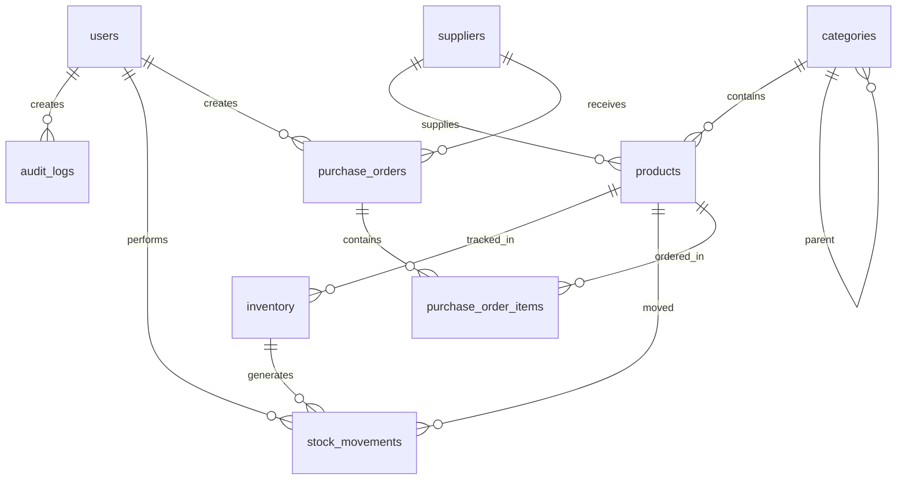

# Inventory Management Backend — Technical Analysis & Architecture Plan

## PHASE 1: PROJECT ANALYSIS

---

### 1. Current Backend Architecture

The BISFT project is currently a **Python-based ML/Analytics platform** with no operational backend:

| Layer | Current State |
|---|---|
| **API** | FastAPI stub (`main.py`) — 2 endpoints, not connected to agent |
| **Database** | SQLite (`olist.db`) — read-only analytical data |
| **ML Pipeline** | Prophet forecasting, DNN churn prediction, LSTM architecture |
| **Chatbot** | LangGraph multi-agent RAG system with Groq LLM |
| **Auth** | None — no users, no sessions, no JWT |
| **Inventory** | None — no stock tracking, no warehouse, no supplier management |

**Key insight:** The current system is purely analytical. There is NO operational/transactional backend. The inventory module will be the **first operational backend** in this project.

---

### 2. Existing Database Schema (Olist SQLite)

#### 2a. Tables & Row Counts

| Table | Rows | Purpose |
|---|---|---|
| `products` | 32,951 | Product catalog (id, category, dimensions, weight) |
| `sellers` | 3,095 | Marketplace sellers (id, city, state, zip) |
| `customers` | 99,441 | Buyer records (id, unique_id, city, state) |
| `orders` | 99,441 | Order lifecycle (status, timestamps) |
| `order_items` | 112,650 | Line items (product, seller, price, freight) |
| `order_payments` | 103,886 | Payment records (type, installments, value) |
| `order_reviews` | 99,224 | Customer reviews (score, comments) |
| `geolocation` | 1,000,163 | Zip code coordinates |
| `product_category_name_translation` | 71 | Portuguese → English category mapping |

#### 2b. Product Table Schema

```
products
├── product_id                TEXT       (UUID-style hash — PRIMARY KEY)
├── product_category_name     TEXT       (Portuguese, nullable — 610 products missing)
├── product_name_lenght       REAL       (character count of product name)
├── product_description_lenght REAL      (character count of description)
├── product_photos_qty        REAL       (number of photos)
├── product_weight_g          REAL       (weight in grams)
├── product_length_cm         REAL       (package dimensions)
├── product_height_cm         REAL
└── product_width_cm          REAL
```

**Missing for inventory:** No `name`, no `sku`, no `barcode`, no `price`, no `stock_quantity`, no `status`, no `supplier_id`. The product table is a **dimensional catalog** only.

#### 2c. Seller Table Schema

```
sellers
├── seller_id                 TEXT       (UUID-style hash)
├── seller_zip_code_prefix    INTEGER
├── seller_city               TEXT
└── seller_state              TEXT
```

**Missing for inventory:** No `name`, no `email`, no `phone`, no `contact_person`, no `payment_terms`. Sellers are just geographic references.

#### 2d. Order Items Schema (Product-Seller-Price relationship)

```
order_items
├── order_id                  TEXT
├── order_item_id             INTEGER    (sequence within order)
├── product_id                TEXT       → products.product_id
├── seller_id                 TEXT       → sellers.seller_id
├── shipping_limit_date       TEXT
├── price                     REAL       (R$0.85 – R$6,735.00, avg R$120.65)
└── freight_value             REAL       (R$0.00 – R$409.68, avg R$19.99)
```

**Key discovery:** Price lives in `order_items`, NOT in `products`. Each seller sets their own price per product. This is a **marketplace model** where the same product can be sold by multiple sellers at different prices.

---

### 3. Critical Data Relationships

```
products ──(1:N)──► order_items ◄──(N:1)── sellers
                        │
                        ▼
                    orders ──(1:N)──► order_payments
                        │
                        ▼
                    customers
```

**Marketplace Pattern Discovered:**
- 1,225 products are sold by **multiple sellers** (shared catalog)
- Products per seller: min=1, max=399, avg=11.1
- Items per order: min=1, max=21, avg=1.1 (mostly single-item orders)
- 609 orders marked `unavailable` — suggests stock-out scenarios already exist

**Order Status Flow:**
```
created (5) → approved (2) → invoiced (314) → processing (301) 
→ shipped (1,107) → delivered (96,478)
                  → canceled (625)
                  → unavailable (609)
```

---

### 4. What's Missing for Inventory Management

| Component | Current State | Needed |
|---|---|---|
| Product names/descriptions | Only character counts exist | Full product name, description, SKU |
| Product pricing | Lives per-order-item, per-seller | Base price + seller-specific pricing |
| Stock quantities | **Does not exist** | Per-product (or per-product-per-seller) quantities |
| Stock movements | **Does not exist** | Audit trail of all quantity changes |
| Warehouses | **Does not exist** | Optional — single vs multi-warehouse |
| Suppliers | Sellers exist but minimal data | Enhanced seller/supplier records |
| Reorder points | **Does not exist** | Low-stock thresholds per product |
| Purchase orders | **Does not exist** | Inbound stock receiving workflow |
| Users/Auth | **Does not exist** | JWT, roles, permissions |
| Audit logging | **Does not exist** | Who changed what, when |

---

### 5. Architecture Decision: Why a Separate Node.js/PostgreSQL Backend

The existing Python/SQLite system is **analytical and read-only**. Adding operational inventory management directly into it would be architecturally wrong because:

1. **SQLite is single-writer** — can't handle concurrent inventory transactions
2. **The Python system treats the DB as read-only** (all connections use `?mode=ro`)
3. **Inventory needs ACID transactions** — PostgreSQL provides this natively
4. **Different concerns** — ML/analytics vs. CRUD operations vs. real-time stock tracking
5. **Team separation** — your friend does frontend, you do Node.js backend, Python ML stays independent

**Chosen Architecture:**

```
┌─────────────────────────────────────────────────────────┐
│                    FRONTEND (Friend)                     │
│              React / Next.js (separate repo)             │
└──────────────────────┬──────────────────────────────────┘
                       │ REST API calls
                       ▼
┌─────────────────────────────────────────────────────────┐
│           INVENTORY BACKEND (Node.js/TypeScript)         │
│  Express.js + Prisma ORM + PostgreSQL                    │
│                                                          │
│  ┌──────────┐  ┌──────────┐  ┌──────────┐               │
│  │  Routes   │→│ Services  │→│ Prisma    │→ PostgreSQL   │
│  │(Controllers)│ (Business  │  │(Repository)│              │
│  │          │  │ Logic)    │  │          │               │
│  └──────────┘  └──────────┘  └──────────┘               │
│                                                          │
│  ┌──────────┐  ┌──────────┐  ┌──────────┐               │
│  │   Auth   │  │Validation │  │  Audit   │               │
│  │  (JWT)   │  │  (Zod)    │  │  Logger  │               │
│  └──────────┘  └──────────┘  └──────────┘               │
└─────────────────────────────────────────────────────────┘
                       │
                       │ Data seed / sync (one-time)
                       ▼
┌─────────────────────────────────────────────────────────┐
│         PYTHON ML BACKEND (existing — untouched)         │
│  SQLite (Olist) → KPI Engine → Chatbot → Analytics       │
└─────────────────────────────────────────────────────────┘
```

---

### 6. Recommended Modules & Services

```
inventory-backend/
├── prisma/
│   └── schema.prisma              # Database schema
├── src/
│   ├── app.ts                     # Express app setup
│   ├── server.ts                  # Server entry point
│   ├── config/
│   │   ├── database.ts            # Prisma client singleton
│   │   ├── env.ts                 # Environment validation
│   │   └── constants.ts           # Business constants
│   ├── middleware/
│   │   ├── auth.middleware.ts      # JWT verification
│   │   ├── role.middleware.ts      # Role-based access
│   │   ├── validate.middleware.ts  # Zod request validation
│   │   ├── error.middleware.ts     # Global error handler
│   │   └── audit.middleware.ts     # Audit logging
│   ├── modules/
│   │   ├── auth/
│   │   │   ├── auth.routes.ts
│   │   │   ├── auth.service.ts
│   │   │   ├── auth.schema.ts     # Zod validation schemas
│   │   │   └── auth.types.ts
│   │   ├── products/
│   │   │   ├── product.routes.ts
│   │   │   ├── product.service.ts
│   │   │   ├── product.schema.ts
│   │   │   └── product.types.ts
│   │   ├── categories/
│   │   │   ├── category.routes.ts
│   │   │   ├── category.service.ts
│   │   │   └── category.schema.ts
│   │   ├── inventory/
│   │   │   ├── inventory.routes.ts
│   │   │   ├── inventory.service.ts  # Core stock management
│   │   │   ├── inventory.schema.ts
│   │   │   └── inventory.types.ts
│   │   ├── suppliers/
│   │   │   ├── supplier.routes.ts
│   │   │   ├── supplier.service.ts
│   │   │   └── supplier.schema.ts
│   │   ├── purchase-orders/
│   │   │   ├── purchase-order.routes.ts
│   │   │   ├── purchase-order.service.ts
│   │   │   └── purchase-order.schema.ts
│   │   └── alerts/
│   │       ├── alert.routes.ts
│   │       └── alert.service.ts
│   ├── shared/
│   │   ├── errors/                # Custom error classes
│   │   ├── utils/                 # Helpers (pagination, response formatting)
│   │   └── types/                 # Shared TypeScript types
│   └── seed/
│       └── seed-from-olist.ts     # One-time data migration from SQLite
├── .env
├── package.json
├── tsconfig.json
└── README.md
```

---

### 7. Database Design (PostgreSQL + Prisma)

#### 7a. Entity Relationship Diagram



#### 7b. Table Designs

**users** — Auth and access control
```sql
id              UUID        PK DEFAULT gen_random_uuid()
email           VARCHAR(255) UNIQUE NOT NULL
password_hash   VARCHAR(255) NOT NULL
full_name       VARCHAR(100) NOT NULL
role            ENUM('admin','manager','staff','viewer') DEFAULT 'staff'
is_active       BOOLEAN     DEFAULT true
created_at      TIMESTAMPTZ DEFAULT NOW()
updated_at      TIMESTAMPTZ DEFAULT NOW()
```

**categories** — Self-referencing hierarchy (from Olist's 71 categories)
```sql
id              UUID        PK
name            VARCHAR(100) NOT NULL
name_pt         VARCHAR(100)          -- Original Portuguese name
slug            VARCHAR(100) UNIQUE NOT NULL
parent_id       UUID        FK → categories.id (nullable)
description     TEXT
is_active       BOOLEAN     DEFAULT true
sort_order      INTEGER     DEFAULT 0
created_at      TIMESTAMPTZ
updated_at      TIMESTAMPTZ
```

**products** — Extended from Olist products table
```sql
id              UUID        PK
legacy_id       VARCHAR(64)          -- Original Olist product_id (for traceability)
sku             VARCHAR(50) UNIQUE NOT NULL
barcode         VARCHAR(50) UNIQUE
name            VARCHAR(255) NOT NULL
description     TEXT
category_id     UUID        FK → categories.id
supplier_id     UUID        FK → suppliers.id (nullable)
status          ENUM('active','inactive','archived','discontinued') DEFAULT 'active'
-- Pricing
base_price      DECIMAL(10,2) NOT NULL DEFAULT 0
cost_price      DECIMAL(10,2)
-- Physical attributes (from Olist)
weight_g        DECIMAL(10,2)
length_cm       DECIMAL(10,2)
height_cm       DECIMAL(10,2)
width_cm        DECIMAL(10,2)
photos_qty      INTEGER     DEFAULT 0
-- Inventory thresholds
reorder_point   INTEGER     DEFAULT 10
reorder_qty     INTEGER     DEFAULT 50
-- Metadata
created_at      TIMESTAMPTZ
updated_at      TIMESTAMPTZ
```

**inventory** — Current stock levels (single source of truth)
```sql
id              UUID        PK
product_id      UUID        FK → products.id UNIQUE
quantity         INTEGER     NOT NULL DEFAULT 0
reserved_qty    INTEGER     NOT NULL DEFAULT 0  -- Reserved by pending orders
available_qty   INTEGER     GENERATED (quantity - reserved_qty)
last_restock_at TIMESTAMPTZ
last_sold_at    TIMESTAMPTZ
updated_at      TIMESTAMPTZ
```

> **Design decision:** One `inventory` row per product (no multi-warehouse). The Olist data shows a marketplace with sellers shipping directly — no central warehouse. We keep it simple and add warehouse support later if needed.

**stock_movements** — Audit trail of every inventory change
```sql
id              UUID        PK
product_id      UUID        FK → products.id
movement_type   ENUM('IN','OUT','ADJUSTMENT','RESERVATION','RELEASE','RETURN')
quantity         INTEGER     NOT NULL  -- Positive for IN, negative for OUT
quantity_before  INTEGER     NOT NULL
quantity_after   INTEGER     NOT NULL
reason          VARCHAR(255)
reference_type  VARCHAR(50)           -- 'purchase_order', 'order', 'manual', 'adjustment'
reference_id    UUID                  -- ID of related PO or order
performed_by    UUID        FK → users.id
created_at      TIMESTAMPTZ DEFAULT NOW()
```

**suppliers** — Extended from Olist sellers
```sql
id              UUID        PK
legacy_seller_id VARCHAR(64)          -- Original Olist seller_id
name            VARCHAR(255) NOT NULL
email           VARCHAR(255)
phone           VARCHAR(50)
contact_person  VARCHAR(100)
city            VARCHAR(100)
state           VARCHAR(10)
zip_code        VARCHAR(20)
payment_terms   VARCHAR(100)
lead_time_days  INTEGER     DEFAULT 7
is_active       BOOLEAN     DEFAULT true
notes           TEXT
created_at      TIMESTAMPTZ
updated_at      TIMESTAMPTZ
```

**purchase_orders** — Inbound stock receiving
```sql
id              UUID        PK
po_number       VARCHAR(20) UNIQUE NOT NULL  -- Auto-generated: PO-2026-00001
supplier_id     UUID        FK → suppliers.id
status          ENUM('draft','submitted','confirmed','partial','received','cancelled')
order_date      TIMESTAMPTZ DEFAULT NOW()
expected_date   TIMESTAMPTZ
received_date   TIMESTAMPTZ
total_amount    DECIMAL(12,2)
notes           TEXT
created_by      UUID        FK → users.id
created_at      TIMESTAMPTZ
updated_at      TIMESTAMPTZ
```

**purchase_order_items**
```sql
id              UUID        PK
purchase_order_id UUID      FK → purchase_orders.id
product_id      UUID        FK → products.id
quantity_ordered INTEGER    NOT NULL
quantity_received INTEGER   DEFAULT 0
unit_cost       DECIMAL(10,2) NOT NULL
created_at      TIMESTAMPTZ
```

**audit_logs** — System-wide audit trail
```sql
id              UUID        PK
user_id         UUID        FK → users.id
action          VARCHAR(50) NOT NULL  -- 'CREATE','UPDATE','DELETE','STOCK_ADJUST'
entity_type     VARCHAR(50) NOT NULL  -- 'product','inventory','purchase_order'
entity_id       UUID
old_values      JSONB
new_values      JSONB
ip_address      VARCHAR(45)
created_at      TIMESTAMPTZ DEFAULT NOW()
```

---

### 8. Feature Justification Based on Current Data

| Feature | Justified? | Reasoning |
|---|---|---|
| **Product CRUD** | YES | 32,951 products exist but lack operational fields (name, SKU, status) |
| **Categories** | YES | 71 categories already exist, need hierarchy + English names |
| **Stock tracking** | YES | 609 "unavailable" orders prove stock-outs are a real problem |
| **Stock movements** | YES | Essential audit trail — who changed what |
| **Suppliers** | YES | 3,095 sellers exist, natural evolution to supplier management |
| **Purchase orders** | YES | Needed to properly track inbound stock |
| **Low-stock alerts** | YES | Reorder points needed to prevent the 609 unavailable scenarios |
| **Multi-warehouse** | NO (not yet) | Olist is marketplace (sellers ship direct). Add later if needed |
| **Batch/lot tracking** | NO (not yet) | Not relevant to current product types (no perishables/pharma) |
| **Serial numbers** | NO (not yet) | Products are generic marketplace items, not serialized assets |
| **Returns management** | NO (not yet) | Build as separate module after inventory is stable |

---

### 9. API Structure

**Base URL:** `/api/v1`

#### Auth
| Method | Endpoint | Description |
|---|---|---|
| POST | `/auth/register` | Register new user (admin only) |
| POST | `/auth/login` | Login, returns JWT token |
| POST | `/auth/refresh` | Refresh access token |
| GET | `/auth/me` | Get current user profile |

#### Products
| Method | Endpoint | Description | Role |
|---|---|---|---|
| GET | `/products` | List/search/filter products | viewer+ |
| GET | `/products/:id` | Get product detail + stock | viewer+ |
| POST | `/products` | Create product | manager+ |
| PATCH | `/products/:id` | Update product | manager+ |
| PATCH | `/products/:id/status` | Change status (archive/discontinue) | manager+ |
| GET | `/products/low-stock` | Products below reorder point | staff+ |

#### Categories
| Method | Endpoint | Description | Role |
|---|---|---|---|
| GET | `/categories` | List all (tree structure) | viewer+ |
| POST | `/categories` | Create category | admin |
| PATCH | `/categories/:id` | Update category | admin |
| DELETE | `/categories/:id` | Soft-delete category | admin |

#### Inventory
| Method | Endpoint | Description | Role |
|---|---|---|---|
| GET | `/inventory` | List all stock levels | staff+ |
| GET | `/inventory/:productId` | Get stock for product | staff+ |
| POST | `/inventory/add-stock` | Add stock (with reason) | manager+ |
| POST | `/inventory/remove-stock` | Remove stock (with reason) | manager+ |
| POST | `/inventory/adjust` | Adjustment (correction) | manager+ |
| GET | `/inventory/movements/:productId` | Stock movement history | staff+ |
| GET | `/inventory/alerts` | Low stock alerts | staff+ |

#### Suppliers
| Method | Endpoint | Description | Role |
|---|---|---|---|
| GET | `/suppliers` | List suppliers | staff+ |
| GET | `/suppliers/:id` | Supplier detail + products | staff+ |
| POST | `/suppliers` | Create supplier | manager+ |
| PATCH | `/suppliers/:id` | Update supplier | manager+ |

#### Purchase Orders
| Method | Endpoint | Description | Role |
|---|---|---|---|
| GET | `/purchase-orders` | List POs | staff+ |
| GET | `/purchase-orders/:id` | PO detail with items | staff+ |
| POST | `/purchase-orders` | Create PO | manager+ |
| PATCH | `/purchase-orders/:id/status` | Update PO status | manager+ |
| POST | `/purchase-orders/:id/receive` | Receive stock (updates inventory) | manager+ |

---

### 10. Transaction Management Strategy

**Critical operations that require transactions:**

1. **Stock Addition** (add-stock):
   ```
   BEGIN TRANSACTION
     → UPDATE inventory SET quantity = quantity + N
     → INSERT stock_movement (type=IN, qty=+N)
     → INSERT audit_log
   COMMIT
   ```

2. **Stock Removal** (remove-stock):
   ```
   BEGIN TRANSACTION
     → SELECT quantity FROM inventory WHERE product_id = X FOR UPDATE  (row lock)
     → VALIDATE: quantity >= requested_amount
     → UPDATE inventory SET quantity = quantity - N
     → INSERT stock_movement (type=OUT, qty=-N)
     → INSERT audit_log
   COMMIT (or ROLLBACK if insufficient stock)
   ```

3. **Purchase Order Receiving**:
   ```
   BEGIN TRANSACTION
     → UPDATE purchase_order SET status = 'received'
     → FOR EACH item:
         → UPDATE inventory SET quantity = quantity + received_qty
         → INSERT stock_movement (type=IN, reference=PO)
     → INSERT audit_log
   COMMIT
   ```

**Prisma handles this with `prisma.$transaction()`** — interactive transactions with automatic rollback on error.

**Concurrency protection:** Use `SELECT ... FOR UPDATE` (row-level locks) via Prisma raw queries for stock updates to prevent race conditions.

---

### 11. Validation & Security Approach

**Validation (Zod):**
- Request body validation on all POST/PATCH endpoints
- Type-safe schemas that match Prisma types
- Custom validators for business rules (e.g., `quantity > 0`, valid SKU format)

**Authentication (JWT):**
- Access token (15min TTL) + Refresh token (7 days)
- Tokens stored in httpOnly cookies or Authorization header
- Password hashing with bcrypt (12 rounds)

**Authorization (Role-based):**
| Role | Permissions |
|---|---|
| `admin` | Full access — manage users, categories, system config |
| `manager` | CRUD products, manage inventory, create POs, manage suppliers |
| `staff` | View all data, perform basic stock operations |
| `viewer` | Read-only access to products and inventory levels |

**Security layers:**
- Rate limiting (express-rate-limit)
- Input sanitization
- SQL injection protection (Prisma parameterized queries)
- CORS configuration
- Helmet.js security headers

---

### 12. Scalability Considerations

| Concern | Solution |
|---|---|
| **Database growth** | PostgreSQL handles millions of rows natively. Indexed on product_id, category_id, supplier_id |
| **Stock movement volume** | Partitioned by `created_at` if table exceeds 10M rows |
| **Concurrent stock updates** | Row-level locks via `FOR UPDATE` prevent race conditions |
| **API performance** | Pagination on all list endpoints (cursor-based for large datasets) |
| **Search** | PostgreSQL full-text search on product name/description (no Elasticsearch needed yet) |
| **Future multi-warehouse** | `inventory` table can add `warehouse_id` FK later without breaking existing queries |
| **Future microservices** | Module-based structure allows extraction into separate services later |
| **Caching** | Redis layer can be added for frequently-read stock levels |

---

### 13. Frontend Integration Guide

The frontend team should consume the backend via REST API:

```
Frontend (React/Next.js)
    │
    ├── Login → POST /api/v1/auth/login → receives JWT
    │
    ├── Dashboard → GET /api/v1/inventory/alerts (low stock)
    │             → GET /api/v1/products?page=1&limit=20
    │
    ├── Product Page → GET /api/v1/products/:id
    │               → PATCH /api/v1/products/:id (edit)
    │               → POST /api/v1/inventory/add-stock (restock)
    │
    ├── Inventory Page → GET /api/v1/inventory?sort=quantity&order=asc
    │                  → GET /api/v1/inventory/movements/:productId
    │
    ├── Suppliers Page → GET /api/v1/suppliers
    │                  → POST /api/v1/purchase-orders (create PO)
    │
    └── All requests include: Authorization: Bearer <JWT>
```

**Response format (consistent across all endpoints):**
```json
{
  "success": true,
  "data": { ... },
  "meta": {
    "page": 1,
    "limit": 20,
    "total": 32951,
    "totalPages": 1648
  }
}
```

**Error format:**
```json
{
  "success": false,
  "error": {
    "code": "INSUFFICIENT_STOCK",
    "message": "Cannot remove 50 units. Only 23 available.",
    "details": { "available": 23, "requested": 50 }
  }
}
```

---

### 14. Data Seeding Strategy

One-time migration script (`seed-from-olist.ts`) will:

1. Read Olist SQLite → Extract 71 categories → Insert into PostgreSQL `categories`
2. Read 3,095 sellers → Insert as `suppliers` (with city/state/zip)
3. Read 32,951 products → Generate SKUs → Map categories → Insert as `products`
4. Initialize `inventory` with quantity=0 for all products (no historical stock data exists)
5. Create default admin user

This preserves `legacy_id` / `legacy_seller_id` fields for traceability back to analytical data.

---

### 15. Implementation Order

| Step | Module | Description |
|---|---|---|
| 1 | **Project setup** | Initialize Node.js/TS project, Prisma, PostgreSQL connection |
| 2 | **Schema** | Define all Prisma models, run migration |
| 3 | **Auth module** | JWT registration/login, middleware, role guards |
| 4 | **Categories module** | CRUD + tree structure + seed from Olist |
| 5 | **Products module** | CRUD + search/filter + seed from Olist |
| 6 | **Inventory module** | Stock operations + movements + transactions |
| 7 | **Suppliers module** | CRUD + link to products |
| 8 | **Purchase Orders** | PO workflow + receiving + auto stock update |
| 9 | **Alerts** | Low stock detection + threshold management |
| 10 | **Audit logging** | Middleware + log viewer endpoint |
| 11 | **Seed script** | Migrate Olist data into PostgreSQL |
| 12 | **Testing and polish** | Error handling, edge cases, documentation |
